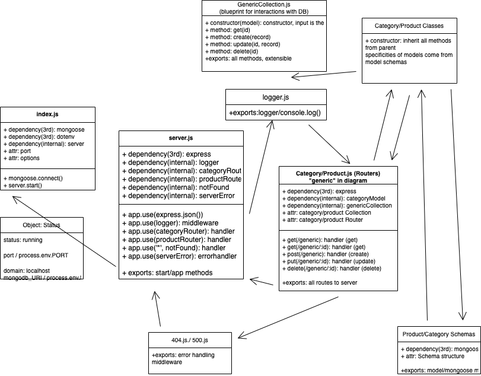

# api-server
Basic Express/Node Server using Mongoose to preform CRUD actions

## Author: Anne Thorsteinson

**[Tests](https://github.com/AnneThor/api-server/actions)**

**[Front End](#)**

## Setup

```.env``` requirements:

- ```PORT``` - port number

## Running the App

- ```npm start```
- Endpoints:
* ```/product``` or ```/category``` will return a json list of all current records including the id and data about the item
* ```/product/:id``` or ```/category/:id``` will return just the item at the supplied id
* ```POST``` requests to ```/product``` or ```category``` will create a new item with an incremented index and the data from the ```req.body```
* ```PUT``` requests to ```/product/:id``` or ```/category/:id``` will find the item at the given index from the respective database and update the data stored in that index with the data from ```req.body```
* ```DELETE``` requests to ```/product/:id``` or ```/category/:id``` will delete the item at the provided index (if it exits) and will return null

## Tests

- Unit Tests: ```npm run test``` (tests for server, routes, and models currently implemented)
- Lint Tests: ```npm run lint```


## UML Diagram


